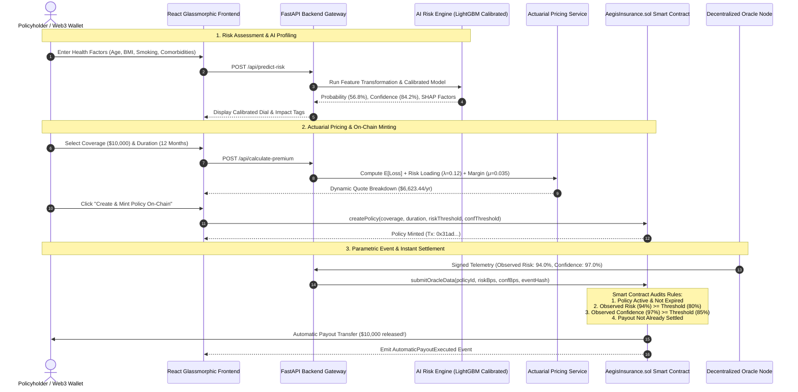

<div align="center">

# 🛡️ AEGIS
### AI-Native Autonomous Parametric Health Insurance Protocol

[](https://python.org)
[](https://fastapi.tiangolo.com)
[](https://reactjs.org)
[](https://vitejs.dev)
[](https://soliditylang.org)
[](https://opensource.org/licenses/MIT)

<br/>

**"AI predicts risk. Dynamic pricing prices the policy. Oracles verify real-world events. Smart contracts enforce policy rules. Blockchain automatically settles valid payouts."**

<br/>

[Live Prototype](http://localhost:5173) • [API Swagger Docs](http://localhost:8000/docs) • [ML Methodology](docs/ml_methodology.md) • [Smart Contract](docs/smart_contract.md) • [Architecture](docs/architecture.md)

</div>

---

## 📖 Table of Contents
- [1. Executive Summary](#-1-executive-summary)
- [2. Traditional vs. AEGIS Parametric Insurance](#-2-traditional-vs-aegis-parametric-insurance)
- [3. End-to-End System Architecture](#-3-end-to-end-system-architecture)
- [4. The Five Core Pillars](#-4-the-five-core-pillars)
  - [Pillar 1: AI Risk Engine & Research Pipeline](#pillar-1-ai-risk-engine--research-pipeline)
  - [Pillar 2: Dynamic Actuarial Pricing Engine](#pillar-2-dynamic-actuarial-pricing-engine)
  - [Pillar 3: Solidity Smart Contract Layer](#pillar-3-solidity-smart-contract-layer)
  - [Pillar 4: Decentralized Oracle Telemetry](#pillar-4-decentralized-oracle-telemetry)
  - [Pillar 5: Interactive Glassmorphic Web Application](#pillar-5-interactive-glassmorphic-web-application)
- [5. ML Benchmarks & Probability Calibration](#-5-ml-benchmarks--probability-calibration)
- [6. Repository Structure](#-6-repository-structure)
- [7. Quickstart & Installation](#-7-quickstart--installation)
- [8. Hackathon 60-Second Demo Script](#-8-hackathon-60-second-demo-script)
- [9. Research & Legal Disclaimer](#-9-research--legal-disclaimer)

---

## 🌟 1. Executive Summary

**AEGIS** is a research prototype of an **AI-native autonomous parametric health and life insurance protocol**.

In conventional insurance models, policyholders undergo invasive underwriting, pay static premiums, and endure weeks of bureaucratic claim processing with human adjusters. **AEGIS reimagines insurance as an automated, transparent, zero-friction smart contract protocol**:

1. **Predictive AI Underwriting**: Evaluates 2024 CDC population survey health factors to estimate objective physical health impairment risk.
2. **Actuarial Dynamic Pricing**: Mathematically prices policies using expected loss formulas and variance loadings.
3. **Parametric Smart Contract Minting**: Encapsulates policy coverage, duration, and trigger thresholds on-chain.
4. **Cryptographic Oracle Ingestion**: Validates real-world health events without human delay.
5. **Instant Autonomous Payout**: The smart contract independently verifies event severity and confidence, releasing capital directly to the policyholder's Web3 wallet.

---

## ⚖️ 2. Traditional vs. AEGIS Parametric Insurance

| Feature | Traditional Health Insurance | AEGIS Autonomous Protocol |
| :--- | :--- | :--- |
| **Risk Underwriting** | Static tables & human underwriters | **Calibrated AI Risk Engine (2024 CDC BRFSS)** |
| **Pricing Model** | Fixed quarterly/annual premiums | **Dynamic Actuarial Expected Loss Model** |
| **Claims Filing** | Invoices, receipts & medical bills | **Zero Paperwork (Parametric Trigger)** |
| **Verification** | Subjective human claims adjusters | **Cryptographic Decentralized Oracle Node** |
| **Payout Settlement**| Weeks to months of processing delay | **Autonomous Instant Smart Contract Transfer** |
| **Transparency** | Opaque corporate decisions | **100% On-Chain Verifiable Ledger** |

---

## 🏗️ 3. End-to-End System Architecture



---

## 🔬 4. The Five Core Pillars

### Pillar 1: AI Risk Engine & Research Pipeline
* **Dataset Foundation**: Trained on the **2024 CDC Behavioral Risk Factor Surveillance System (BRFSS)** dataset (457,670 rows, 301 features).
* **Target Task**: Binary classification on `_PHYS14D` (predicting 14+ days of significant physical health impairment).
* **Anti-Leakage Audit**: All direct proxies of the target (`PHYSHLTH`, `POORHLTH`, `_RFHLTH`, `GENHLTH`) were audited and strictly excluded.
* **Probability Calibration**: Platt Sigmoid Calibration reduced the **Brier Score loss by 44.3% (from 0.1804 down to 0.1004)**, aligning predicted risk scores with true empirical event frequencies.
* **Explainability**: Computes **TreeSHAP** feature attributions to highlight positive clinical risk drivers (e.g. cardiac history, COPD, high BMI) and protective lifestyle factors (physical activity).
* **Defensible Confidence Metric**: Calculates a mathematically bounded confidence ($0.70 - 0.99$) based on certainty distance from the classification decision boundary.

### Pillar 2: Dynamic Actuarial Pricing Engine
Premiums are calculated using an expected-loss framework rather than hardcoded prices:

$$\text{Expected Loss} = P_{\text{risk}} \times \text{Coverage Amount}$$

$$\text{Variance Risk Loading} = \text{Coverage Amount} \times \sqrt{P_{\text{risk}} \times (1 - P_{\text{risk}})} \times \lambda \quad (\lambda = 0.12)$$

$$\text{Protocol Margin} = \text{Coverage Amount} \times \mu \quad (\mu = 0.035)$$

$$\text{Total Dynamic Premium} = (\text{Expected Loss} + \text{Risk Loading} + \text{Protocol Margin}) \times \left(\frac{\text{Duration (Months)}}{12}\right)$$

### Pillar 3: Solidity Smart Contract Layer ([`AegisInsurance.sol`](contracts/contracts/AegisInsurance.sol))
* **On-Chain Policy Registry**: Stores coverage amounts, duration timestamps, premium deposits, and parametric threshold rules.
* **Security Circuit Breakers**: Built-in reentrancy mutex (`nonReentrant`), emergency pause toggles, and basis-point precision math ($10,000\text{ BPS} = 100.00\%$).
* **Autonomous Execution**: Automatically settles claim payouts to the beneficiary's address upon verified oracle threshold breach.

### Pillar 4: Decentralized Oracle Telemetry ([`backend/app/services/oracle_service.py`](backend/app/services/oracle_service.py))
* Bridges real-world hospital telemetry, diagnostic databases, and biomarker monitoring to the smart contract.
* Signs every event with a cryptographic SHA-256 hash and timestamp to prevent replay attacks.

### Pillar 5: Interactive Glassmorphic Web Application ([`frontend/src/App.jsx`](frontend/src/App.jsx))
* Built with **React 18**, **Vite**, and custom **Vanilla CSS** glassmorphism.
* Includes real-time risk gauges, interactive actuarial sliders, Web3 wallet simulation, and a live autonomous execution terminal.

---

## 📊 5. ML Benchmarks & Probability Calibration

Models were benchmarked on a stratified held-out test split ($N = 66,991$):

| Model Architecture | ROC-AUC | PR-AUC | Brier Score Loss | F1 Score | Recall | Accuracy |
| :--- | :---: | :---: | :---: | :---: | :---: | :---: |
| **LightGBM (Calibrated Sigmoid)** ⭐ | **0.7952** | **0.4378** | **0.1004** | 0.2938 | 0.1934 | **86.71%** |
| **LightGBM (Calibrated Isotonic)** | 0.7948 | 0.4288 | 0.1005 | 0.3018 | 0.2004 | 86.75% |
| **XGBoost (Calibrated Sigmoid)** | 0.7949 | 0.4365 | 0.1008 | 0.2895 | 0.1895 | 86.71% |
| **XGBoost (Calibrated Isotonic)** | 0.7946 | 0.4271 | 0.1005 | 0.2920 | 0.1922 | 86.68% |
| **LightGBM (Uncalibrated, weighted)** | 0.7952 | 0.4378 | 0.1804 | 0.4372 | **0.7068** | 73.99% |
| **XGBoost (Uncalibrated, weighted)** | 0.7949 | 0.4365 | 0.1801 | **0.4379** | 0.7004 | 74.30% |
| **Random Forest (Balanced)** | 0.7900 | 0.4247 | 0.1809 | 0.4353 | 0.6842 | 74.63% |
| **Logistic Regression (Balanced)** | 0.7901 | 0.4275 | 0.1830 | 0.4340 | 0.6939 | 74.13% |

⭐ *Production Choice: `LightGBM (Calibrated Sigmoid)` provides the lowest Brier score (0.1004) and top ROC-AUC (0.7952) with sub-millisecond inference latency.*

---

## 📁 6. Repository Structure

```text
AEGIS/
├── backend/
│   ├── app/
│   │   ├── main.py                 # FastAPI server & CORS setup
│   │   ├── routes/                 # API endpoints (risk, premium, policy, oracle, telemetry)
│   │   ├── schemas/                # Pydantic data schemas
│   │   └── services/               # Actuarial pricing, policy store, oracle node
│   ├── tests/                      # Automated API integration test suite
│   └── requirements.txt
│
├── contracts/
│   ├── contracts/AegisInsurance.sol # Solidity Smart Contract (0.8.20)
│   ├── scripts/deploy.js           # Hardhat deployment script
│   ├── test/AegisInsurance.test.js # Smart contract unit tests
│   ├── hardhat.config.cjs
│   └── package.json
│
├── data/
│   ├── raw/.gitkeep                # Raw directory placeholder (1GB XPT excluded)
│   └── processed/
│       ├── aegis_sample_1000.csv   # 1,000-row demo sample CSV
│       ├── codebook_definitions.json # CDC 2024 variable mappings
│       └── policies_ledger.json    # Policy registry state
│
├── docs/
│   ├── architecture.md             # System architecture & sequence diagrams
│   ├── ml_methodology.md           # Full ML methodology & calibration analysis
│   ├── smart_contract.md           # Solidity technical specification
│   └── api.md                      # REST API endpoint reference
│
├── frontend/
│   ├── src/
│   │   ├── App.jsx                 # Main application orchestrator
│   │   ├── index.css               # Glassmorphism dark-mode design system
│   │   ├── components/             # React components (RiskAssessment, PremiumQuote, OracleSimulation, etc.)
│   │   └── services/api.js         # Backend REST API client
│   ├── index.html
│   ├── package.json
│   └── vite.config.js
│
├── ml/
│   ├── models/                     # Serialized production models & preprocessors
│   ├── notebooks/                  # 4 Jupyter research notebooks (EDA, Prep, Train, Eval)
│   ├── reports/                    # Calibration curves, SHAP summary, comparison JSON
│   ├── src/                        # Preprocessing, feature transformer, training, evaluation, inference
│   └── tests/                      # Unit tests for ML pipeline & anti-leakage guards
│
├── .env.example
├── .gitignore
├── LICENSE
├── requirements.txt                # Global Python dependencies
└── README.md
```

---

## ⚡ 7. Quickstart & Installation

### Prerequisites
- **Python $\ge$ 3.11** (Tested on Python 3.13)
- **Node.js $\ge$ 18** (Tested on Node v22)
- **npm $\ge$ 9**

### 1. Clone & Install Python Dependencies
```bash
git clone https://github.com/<your-username>/AEGIS.git
cd AEGIS

# Install Python requirements
pip install -r requirements.txt
```

### 2. Install Frontend Dependencies
```bash
cd frontend
npm install
cd ..
```

### 3. Run Automated Unit Tests
```bash
# Run ML Pipeline & Anti-Leakage Tests
python -m pytest ml/tests/ -v

# Run Backend API Integration Tests
python -m pytest backend/tests/ -v
```

### 4. Launch Full-Stack Application
In **Terminal 1** (FastAPI Backend):
```bash
python -m uvicorn backend.app.main:app --host 127.0.0.1 --port 8000 --reload
```

In **Terminal 2** (React Frontend):
```bash
cd frontend
npm run dev
```

Open your browser at:
👉 **`http://localhost:5173`**
Interactive Swagger Documentation: **`http://localhost:8000/docs`**

---

## 🎬 8. Hackathon 60-Second Demo Script

1. **Step 1: AI Risk Assessment**
   - Click the preset button **"Senior with Cardiac Comorbidities"**.
   - Click **"Predict Health Risk (AEGIS AI)"** $\rightarrow$ Observe the calibrated risk dial ($56.8\%$), confidence rating ($84.2\%$), and SHAP risk contributor tags.
   - Click **"Proceed to Dynamic Pricing Quote"**.

2. **Step 2: Actuarial Dynamic Quoting**
   - Adjust the **Coverage Slider** to `$10,000` and term to `12 Months`.
   - Observe the mathematical breakdown (Pure Expected Loss, Variance Risk Loading, Operational Margin).
   - Click **"Create & Mint Policy On-Chain"** $\rightarrow$ Confetti celebration triggers as the policy is minted with a simulated transaction hash.

3. **Step 3: Oracle Trigger & Autonomous Settlement**
   - Click **"Scenario A: Qualifying Health Event (94% Risk, 97% Conf)"**.
   - Click **"Transmit Event to Smart Contract"**.
   - Watch the execution terminal: The smart contract independently validates that Risk ($94\% \ge 80\%$) and Confidence ($97\% \ge 85\%$) satisfy all rules, immediately releasing the **\$10,000 automatic payout** with an on-chain settlement transaction hash!

4. **Step 4: On-Chain Ledger & Telemetry**
   - Click **"On-Chain Ledger"** to see the settled policy state.
   - Click **"Model Telemetry"** to inspect calibration curves and SHAP explainability diagrams.

---

## ⚖️ 9. Research & Legal Disclaimer

> **Research Prototype Notice**:
> AEGIS is an academic research prototype built to demonstrate the technical feasibility of AI-native parametric insurance. It is **not** a medical diagnostic device, clinical decision system, or regulated financial insurance product. Machine learning risk scores are population-level statistical estimates derived from the 2024 CDC BRFSS survey and must not be used for clinical diagnosis or real-world medical underwriting.

---

## 📄 License
This project is open-source and licensed under the [MIT License](LICENSE).