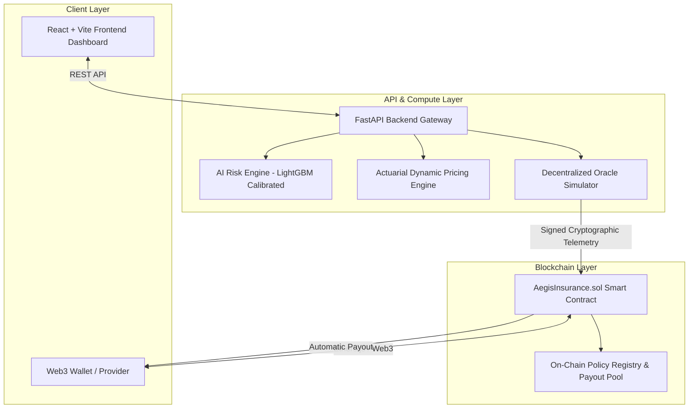
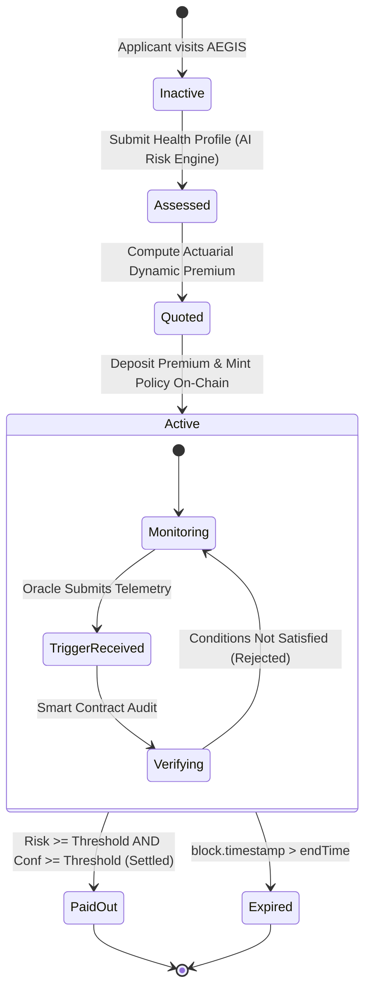

# AEGIS System Architecture & Protocol Design

## 1. System Overview
**AEGIS** is an AI-native autonomous parametric health insurance protocol designed to eliminate administrative claims processing, claims adjusters, and payment friction through a decentralized, algorithmic pipeline.

---

## 2. Component Responsibilities

| Component | Technology | Primary Function |
| :--- | :--- | :--- |
| **Frontend Web App** | React 18, Vite, Vanilla CSS | Interactive risk assessment, policy configuration, dynamic quoting, trigger simulation console, and on-chain ledger. |
| **Backend API** | Python 3.13, FastAPI, Pydantic | REST gateway connecting ML inference, dynamic actuarial pricing formulas, and oracle dispatch. |
| **AI Risk Engine** | Scikit-Learn, LightGBM, SHAP | Preprocessing pipeline and Platt-calibrated model estimating physical health impairment risk ($P \in [0, 1]$) with defensible confidence ($0.70-0.99$). |
| **Actuarial Pricing Engine** | Python | Mathematical expected loss calculation with variance risk loading ($\lambda = 0.12$) and operational margin ($\mu = 0.035$). |
| **Smart Contract Layer** | Solidity 0.8.20 | Autonomous parametric policy ledger enforcing independent trigger verification and non-reentrant payouts. |
| **Oracle Service** | Python, SHA-256 Signatures | External event validation node bridging verified medical telemetry into smart contract method calls. |

---

## 3. End-to-End State Machine

